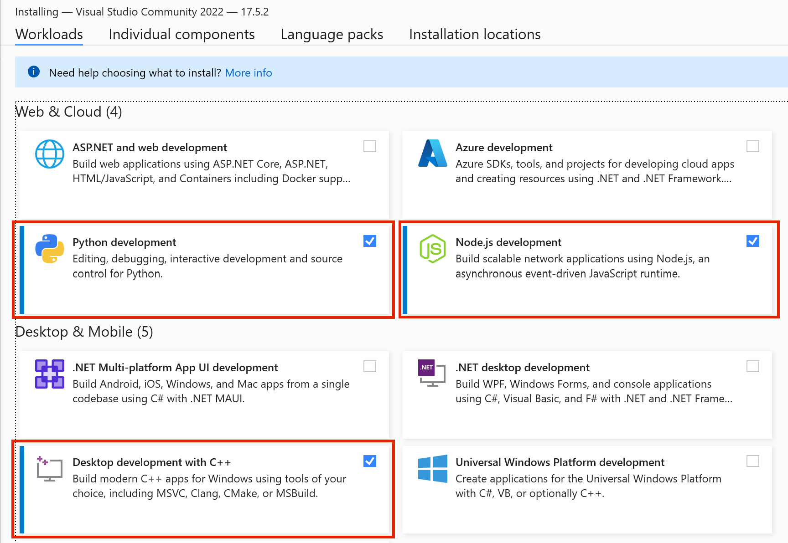
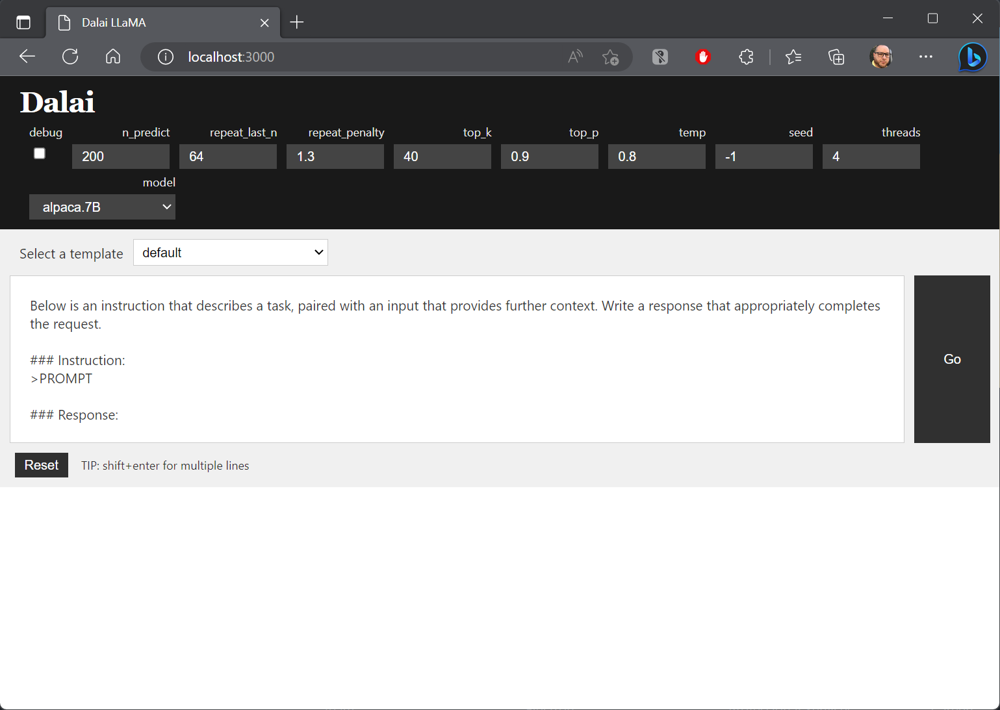

# Run Stanford Alpaca AI on your machine

## Overview

Stanford Alpaca is an open-source language model developed by computer scientists at Stanford University (**1**). It is a seven-billion parameter variant of Meta's LLaMA model (**2**), which has been fine-tuned using supervised learning on 52,000 instruction-following demonstrations (**3**). Alpaca is designed to be able to respond to instructions like ChatGPT (**4**), and it has been demonstrated to perform similarly to the ChatGPT model on many tasks but at a lower cost. The goal of the Alpaca project is to build and share an instruction-following language model with the research community, which can serve as a platform for further research and development.

## System Requirements

- [Visual Studio with Desktop Development for C++](https://visualstudio.microsoft.com/downloads/)
- [Node.js >= 18](https://nodejs.org/en/download)
- [Python 3](https://www.python.org/downloads/)

## Installation and Usage

The following steps will help you run Standford Alpaca AI model using Dalai tools **(6)**.
If you rather see video instructions check this link [LLaMA & Alpaca: “ChatGPT” On Your Local Computer 🤯 | Tutorial](https://www.youtube.com/watch?v=kT_-qUxrlOU&ab_channel=MartinThissen)

1. Download and install system requirements.

    **Note:** When installing Visual Studio don't forget to mark this options 

2. Install Dalai and models.

    ```bash
    npx dalai alpaca install 7B
    ```

3. Start Dalai server

    ```bash
    npx serve
    ```
4. Open Dalai on your brower: http://localhost:3000

5. Select the type of chat prompt and start using Dalai. 

    
## References

1. [Stanford takes costly, risky Alpaca AI model offline • The Register](https://www.theregister.com/2023/03/21/stanford_ai_alpaca_taken_offline/)
2. [Stanford's Alpaca shows that OpenAI may have a problem (the-decoder.com)](https://the-decoder.com/stanfords-alpaca-shows-that-openai-may-have-a-problem/)
3. [Stanford CRFM](https://crfm.stanford.edu/2023/03/13/alpaca.html)
4. [Train and run Stanford Alpaca on your own machine - Replicate – Replicate](https://replicate.com/blog/replicate-alpaca)
5. [tatsu-lab/stanford_alpaca: Code and documentation to train Stanford's Alpaca models, and generate the data. (github.com)](https://github.com/tatsu-lab/stanford_alpaca)
6. [cocktailpeanut/dalai: The simplest way to run LLaMA on your local machine (github.com)](https://github.com/cocktailpeanut/dalai)
